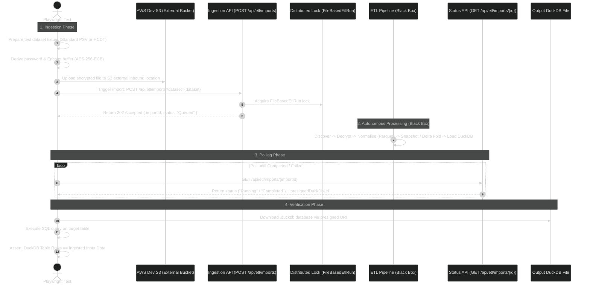

# Data Bridge ETL v2: Black-Box QA Test Architecture & Plan

**Parent Epic:** [`LKPR-30`](https://eaflood.atlassian.net/browse/LKPR-30) — _Data Bridge ETL v2 - Phase I: Multi-stage decrypt/normalise/transform raw data files to duckdb ready for Phase II_

---

## 1. Overview & Testing Philosophy

The **Data Bridge ETL v2** replaces the legacy MongoDB-centric ETL with a high-performance, file-based pipeline that ingests raw encrypted data from external providers, transforms it into columnar Parquet snapshots, and produces a consolidated **DuckDB** database (`.duckdb`) in S3.

Because downstream consumer business REST APIs (e.g. `GET /api/sites`, `GET /api/parties`) do not yet exist for the v2 pipeline, this test suite implements a **pure Black-Box Integration Test Strategy**:

$$\textbf{Encrypted CSV Ingestion (S3)} \longrightarrow \textbf{Black-Box ETL Engine} \longrightarrow \textbf{DuckDB Extract Assertion}$$

The test suite treats the entire backend pipeline as a single black box. Tests do not inspect intermediate S3 storage folders (`raw/`, `normalised/`, `snapshots/`); instead, they verify that **the data ingested at the start accurately matches the data extracted from DuckDB at the end**.

---

## 2. Conceptual Black-Box Flow



---

## 3. Ingestion API Contracts (LKPR-112)

The test suite interacts with the following endpoints:

### A. Trigger Ingestion

- **Endpoint:** `POST /api/etl/imports?sourceType=&dataset=`
- **Query Parameters:**
  - `dataset` _(optional)_: Limits run to a single dataset (e.g. `sam_cph_holdings`). If omitted, all configured datasets run.
  - `sourceType` _(optional)_: E.g., `SAM`, `CTS`.
- **Responses:**
  - `202 Accepted`: `{ "importId": "66a8e1...", "status": "Queued" }`
  - `400 Bad Request`: Invalid dataset or sourceType parameter.
  - `409 Conflict`: Returned if another `FileBasedEtlRun` is currently in progress (includes `inFlightImportId`).

### B. Poll Status & Retrieve DuckDB

- **Endpoint:** `GET /api/etl/imports/{importId}`
- **Response (`Completed`):**
  ```json
  {
    "importId": "66a8e1...",
    "status": "Completed",
    "requestedAt": "2026-08-19T10:00:00Z",
    "completedAt": "2026-08-19T10:01:15Z",
    "datasets": ["sam_cph_holdings"],
    "presignedDuckDbUri": "https://s3.eu-west-2.amazonaws.com/dev-staging/keeper_data_bridge_20260819.duckdb?...",
    "errors": []
  }
  ```

---

## 4. Ingestion Modes & Processing Rules

The pipeline operates in two modes configured per dataset definition:

### 1. Snapshot Mode _(e.g. Reference data like `ct_eartag_formats`)_

- Takes the latest normalised file (by timestamp in filename) as the canonical snapshot.
- Replaces the previous snapshot table in DuckDB.

### 2. Delta Mode _(e.g. `sam_cph_holdings`)_

- **Baseline establishment:** If no snapshot exists, the oldest file is treated as the initial baseline snapshot.
- **Delta folding:** Subsequent delta files are folded chronologically onto the baseline using primary keys:
  - `CHANGE_TYPE = 'I'`: Insert new row.
  - `CHANGE_TYPE = 'U'`: Update existing row matching primary key.
  - `CHANGE_TYPE = 'D'`: **Ignored (Deletes not processed)** per Defra business rule (counted in telemetry, but rows are not deleted).

### 3. Password Derivation Policies

- **Standard Policy (SAM/LITP):** Password equals the exact filename (e.g. `LITP_SAMCPHHOLDING_20251101000010.csv`).
- **CTSM Reverse Policy (CTS/CADS):** Password is derived by extracting the date part from the last segment, reversing all underscore-separated segments, and rejoining with `_` (e.g. `CTSM_UKV_PROD_BULK_123456_CT_EARTAG_FORMATS_2026-02-22-074603.csv` $\rightarrow$ `2026-02-22_FORMATS_EARTAG_CT_123456_BULK_PROD_UKV_CTSM`).

### 4. Legacy H/C/D/T Envelope Formatting (CTS / CADS)

- **Envelope structure:** `H` (Header), `C` (Columns), `D` (Data), `T` (Trailer).
- **Alignment Rule:** The `D` tag on data lines is retained as the first column to align 1:1 with `C` column names, avoiding off-by-one column shift bugs. Known date columns (e.g., `ETF_CURRENT_MODIFIED_DATE`) must contain valid dates (e.g., `13-OCT-99`).

---

## 5. Test Scenarios Matrix

| Test ID         | Scenario                               | Input Dataset                                                                  | Expected Output (DuckDB Verification)                                                                 |
| :-------------- | :------------------------------------- | :----------------------------------------------------------------------------- | :---------------------------------------------------------------------------------------------------- |
| **`TC-ETL-01`** | **Initial Snapshot Ingestion**         | Encrypted `sam_cph_holdings` fixture (10 records).                             | `SELECT COUNT(*) FROM sam_cph_holdings` returns `10`; all field values match fixture.                 |
| **`TC-ETL-02`** | **Delta Upsert Processing**            | 1. Baseline file (10 records)<br>2. Delta file (2 updates `U`, 2 inserts `I`). | `SELECT COUNT(*) FROM sam_cph_holdings` returns `12`; updated records reflect new values.             |
| **`TC-ETL-03`** | **Delta Delete Preservation**          | Delta file containing `CHANGE_TYPE = 'D'` records.                             | Target records remain present in DuckDB table (deletes are not applied).                              |
| **`TC-ETL-04`** | **H/C/D/T Legacy Dataset (CTSM)**      | Encrypted `ct_eartag_formats` with CTSM reverse password policy.               | Table `ct_eartag_formats` created in DuckDB; column alignment matches header (dates in date columns). |
| **`TC-ETL-05`** | **Distributed Lock Collision**         | Trigger two concurrent `POST /api/etl/imports` calls.                          | Second call returns `409 Conflict` with active `inFlightImportId`.                                    |
| **`TC-ETL-06`** | **Malformed Input / Error Resilience** | Corrupted HCDT file (trailer count mismatch or invalid encryption).            | Status reaches `Failed` with safe error summary; pipeline does not crash.                             |

---

## 6. Execution Environment Strategy

```
+-----------------------------------------------------------------------------+
|                        Execution Environment Options                         |
+------------------------------------+----------------------------------------+
| 1. Local Testing (LocalStack/Docker)| 2. Hosted Dev Testing (CDP Dev Cloud)   |
|------------------------------------+----------------------------------------|
| • Fast feedback during dev         | • Full end-to-end cloud validation     |
| • Runs offline / zero AWS cost     | • Tests real AWS S3 and .NET API       |
| • Used for crypto/parser unit tests| • Primary target for QA integration    |
+------------------------------------+----------------------------------------+
```

---

## 7. Next Implementation Steps

1. **`csv-parser.ts` & `record-matcher.ts`**: Utilities under `tests/helpers/` to parse input fixtures and compare all 38+ columns against query results.
2. **`etl-client.ts`**: Playwright API client wrapping file uploads from `tests/data/`, `POST /api/etl/imports`, and polling `GET /api/etl/imports/{importId}` using `expect.poll`.
3. **`duckdb-client.ts`**: Client to download the presigned `.duckdb` file and run SQL assertions.
4. **End-to-End Test Specs**: Test specs under `tests/specs/` executing the test scenario matrix.
