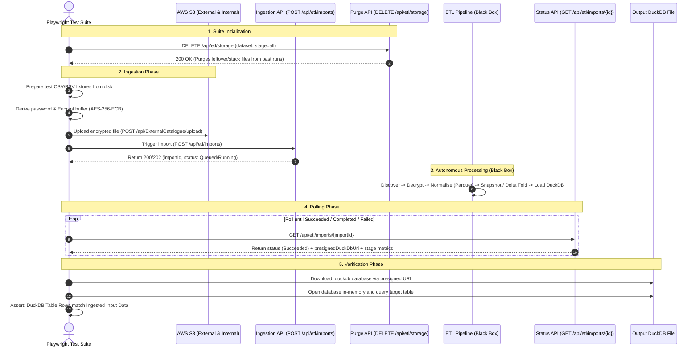
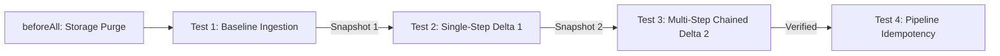

# Data Bridge ETL v2: QA Test Architecture & Framework Guide

> ℹ️ **Test Classification:** All ETL test suites in this repository are **End-to-End (E2E) Black-Box Tests**. They validate the full pipeline lifecycle from external encrypted file upload down to final DuckDB and Parquet snapshot extracts without inspecting internal white-box pipeline mechanics.

**Parent Epic:** [`LKPR-30`](https://eaflood.atlassian.net/browse/LKPR-30) — _Data Bridge ETL v2: Multi-stage decrypt, normalise, snapshot, and load to DuckDB_

---

## 1. Overview & Testing Philosophy

The **Data Bridge ETL v2** replaces the legacy MongoDB-centric ETL with a high-performance, file-based pipeline that ingests raw encrypted data from external providers (SAM, CTS, AMLS2), transforms it into columnar Parquet snapshots, and produces a consolidated **DuckDB** database (`.duckdb`) in S3.

Because downstream consumer business REST APIs (e.g. `/api/sites`, `/api/parties`) do not yet exist for the v2 pipeline, this test framework implements a **pure E2E Black-Box Integration Test Strategy**:

```text
[ Encrypted CSV Ingestion (S3) ] ──▶ [ Black-Box ETL Engine ] ──▶ [ DuckDB & Snapshot Extract Assertion ]
```

The test suite treats the entire backend pipeline as a single black box. Tests do not inspect internal S3 intermediate folders (`raw/`, `normalised/`, `snapshots/`); instead, they verify that **the data ingested at the start accurately matches the data extracted from DuckDB and snapshots at the end**.

---

## 2. Conceptual Black-Box Flow



---

## 3. Ingestion API Contracts

The test suite interacts with the following backend endpoints:

### A. Storage Purge & Clean Slate

- **Endpoint:** `DELETE /api/etl/storage?dataset={dataset}&stage={stage}&sourceType={sourceType}`
- **Query Parameters:**
  - `stage` _(Required)_: Target stage (`all`, `inbound`, `raw`, `normalised`, `snapshots`, `staging`).
  - `dataset` _(Required)_: Target dataset name or `all`.
  - `sourceType` _(Optional)_: `external` (QA drop bucket) or `internal` (default).
- **Rule:** `stage=staging` targets the shared DuckDB database and requires `dataset=all`.

### B. Trigger Ingestion

- **Endpoint:** `POST /api/etl/imports?sourceType={sourceType}&dataset={dataset}`
- **Query Parameters:**
  - `dataset` _(Optional)_: Limits import to a single dataset (e.g. `sam_showground`). If omitted, all configured datasets run.
  - `sourceType` _(Optional)_: `internal` (default) or `external`.
- **Response:** `{ "importId": "833fd17f...", "status": "Queued" | "Running" }`

### C. Poll Status & Retrieve DuckDB

- **Endpoint:** `GET /api/etl/imports/{importId}`
- **Response (`Succeeded`):**
  ```json
  {
    "importId": "833fd17f-025a-4481-a052-f3f037190cd5",
    "status": "Succeeded",
    "stages": [
      { "name": "discover", "itemCount": 1, "elapsedMs": 10 },
      { "name": "decrypt", "itemCount": 1, "elapsedMs": 450 },
      { "name": "normalise", "itemCount": 1, "elapsedMs": 310 },
      { "name": "snapshot", "itemCount": 1, "elapsedMs": 250 },
      { "name": "load-duckdb", "itemCount": 1, "elapsedMs": 10 }
    ],
    "datasets": [
      {
        "dataset": "sam_cph_holdings",
        "snapshotPath": "snapshots/sam_cph_holdings/sam_cph_holdings_20260831.parquet",
        "rowCount": 5,
        "rowsUpserted": 5,
        "rowsIgnoredDeletes": 0
      }
    ],
    "presignedDuckDbUri": "https://s3.eu-west-2.amazonaws.com/dev-staging/keeper_data_bridge_20260831.duckdb?..."
  }
  ```

---

## 4. Ingestion Modes & Defra Business Rules

The pipeline operates in two modes configured per dataset definition:

### 1. Snapshot Mode _(e.g. Reference data like `ct_eartag_formats`)_

- Takes the latest normalised file (by timestamp in filename) as the canonical snapshot.
- Replaces the previous snapshot table in DuckDB.

### 2. Delta Mode _(e.g. `sam_cph_holdings`, `sam_showground`, `sam_herd`)_

- **Baseline establishment:** If no snapshot exists, the oldest file is treated as the initial baseline snapshot.
- **Delta folding:** Subsequent delta files are folded chronologically onto the baseline using primary keys:
  - `CHANGE_TYPE = 'I'`: Insert new row.
  - `CHANGE_TYPE = 'U'`: Update existing row matching primary key.
  - `CHANGE_TYPE = 'D'`: **Ignored (Deletes not processed)** per Defra business rule ([`LKPR-88`](https://eaflood.atlassian.net/browse/LKPR-88)) — counted in telemetry, but rows are preserved.

### 3. Password Derivation Policies

- **Standard Policy (SAM/LITP):** Password equals the exact filename (e.g. `LITP_SAMCPHHOLDING_20251101000010.csv`).
- **CTSM Reverse Policy (CTS/CADS):** Password is derived by extracting the date part from the last segment, reversing all underscore-separated segments, and rejoining with `_` (e.g. `CTSM_UKV_PROD_BULK_123456_CT_EARTAG_FORMATS_2026-02-22-074603.csv` $\rightarrow$ `2026-02-22_FORMATS_EARTAG_CT_123456_BULK_PROD_UKV_CTSM`).

### 4. Legacy H/C/D/T Envelope Formatting (CTS / CADS)

- **Envelope structure:** `H` (Header), `C` (Columns), `D` (Data), `T` (Trailer).
- **Alignment Rule:** The `D` tag on data lines is retained as the first column to align 1:1 with `C` column names, avoiding off-by-one column shift bugs. Known date columns (e.g. `ETF_CURRENT_MODIFIED_DATE`) must contain valid dates (e.g. `13-OCT-99`).

---

## 5. Re-usable 4-Stage Test Suite Architecture

Every dataset in KRDS is tested using the generic, high-speed test suite factory [`pipeline-test-suite.factory.ts`](tests/fixtures/pipeline-test-suite.factory.ts). It executes an incremental 4-stage lifecycle in `test.describe.serial`:



| Stage                   | What is Verified                       | Assertions                                                                             |
| :---------------------- | :------------------------------------- | :------------------------------------------------------------------------------------- |
| **`beforeAll` Hook**    | Wipes S3 stages & orphaned files       | `DELETE /api/etl/storage` returns `200 OK` for external & internal sources.            |
| **Test 1: Baseline**    | Ingests initial baseline CSV           | Verifies schema, column projection, and 1:1 row match against input fixture.           |
| **Test 2: Delta 1**     | Applies single-step updates/inserts    | Verifies in-place field updates, newly inserted keys, and delete preservation (`D`).   |
| **Test 3: Delta 2**     | Folds chained deltas on top of Delta 1 | Verifies chained re-updates and updates applied to records inserted in Delta 1.        |
| **Test 4: Idempotency** | Re-triggers import without new files   | Verifies that re-running the pipeline does not duplicate rows or mutate DuckDB tables. |

---

## 6. Active Dataset Test Suite Matrix

The test framework currently maintains automated test suites and baseline/delta fixtures for the following 7 Defra KRDS datasets:

| Spec File                                                            | Dataset Identifier  | Display Name      | Primary Key | Fixture Files                    |
| :------------------------------------------------------------------- | :------------------ | :---------------- | :---------- | :------------------------------- |
| [`sam-showground.spec.ts`](tests/specs/sam-showground.spec.ts)       | `sam_showground`    | SAM Showground    | `CPH`       | `BASELINE`, `DELTA_1`, `DELTA_2` |
| [`sam-cph-holdings.spec.ts`](tests/specs/sam-cph-holdings.spec.ts)   | `sam_cph_holdings`  | SAM CPH Holdings  | `CPH`       | `BASELINE`, `DELTA_1`, `DELTA_2` |
| [`sam-cph-holder.spec.ts`](tests/specs/sam-cph-holder.spec.ts)       | `sam_cph_holder`    | SAM CPH Holder    | `PARTY_ID`  | `BASELINE`, `DELTA_1`, `DELTA_2` |
| [`sam-herd.spec.ts`](tests/specs/sam-herd.spec.ts)                   | `sam_herd`          | SAM Herd          | `CPH`       | `BASELINE`, `DELTA_1`, `DELTA_2` |
| [`sam-party.spec.ts`](tests/specs/sam-party.spec.ts)                 | `sam_party`         | SAM Party         | `PARTY_ID`  | `BASELINE`, `DELTA_1`, `DELTA_2` |
| [`amls2-port.spec.ts`](tests/specs/amls2-port.spec.ts)               | `amls2_port`        | AMLS2 Port        | `CPH`       | `BASELINE`, `DELTA_1`, `DELTA_2` |
| [`amls2-common-land.spec.ts`](tests/specs/amls2-common-land.spec.ts) | `amls2_common_land` | AMLS2 Common Land | `CPH`       | `BASELINE`, `DELTA_1`, `DELTA_2` |

---

## 7. Framework Helper Components

```
tests/
├── data/                                 # Encrypted CSV/PSV baseline and delta fixtures
├── fixtures/
│   ├── etl-pipeline.fixture.ts           # Playwright custom fixtures (etlClient, duckDbClient)
│   ├── pipeline-test-suite.factory.ts    # Reusable 4-stage sequential test suite generator
│   └── record-matcher.ts                 # Custom Playwright matcher (expect(rows).toMatchRecords)
├── helpers/
│   ├── csv-parser.ts                     # Robust RFC4180 and PSV parser for input CSV files
│   ├── duckdb-client.ts                  # In-memory DuckDB client to open and query exported buffers
│   ├── etl-client.ts                     # API client for uploads, triggers, polling, and purges
│   └── file-processor.ts                 # AES-256-ECB file encryption and password derivation
└── specs/                                # Dataset-specific test specifications
```
